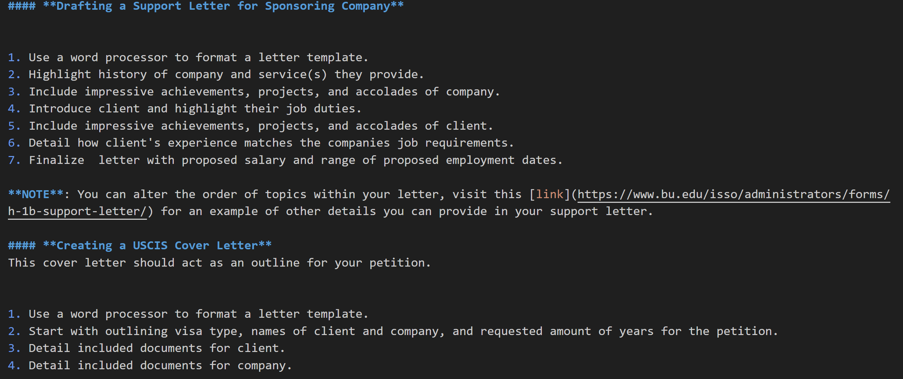
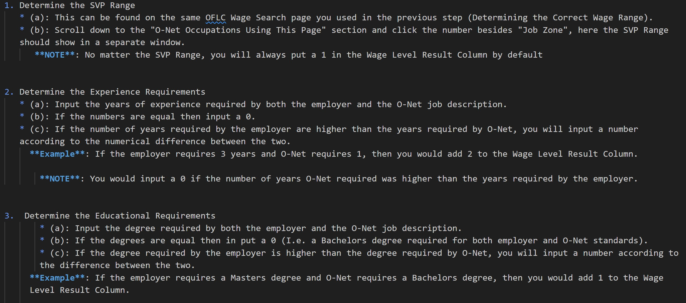

# Procedure Assignment Reflection

Write a short analysis (~500 words) in which you explain what you did to meet the assignment's criteria. Use the criteria as headings to structure your reflection.

## How do your procedures address the needs of a "reading to learn to do audience"? Provide some specific examples that connect back to Redish's noted features of such an audience.

I wanted to highlight what Redish details about letting the user know about the basic structure of the procedure. I did this by laying out in the staging move, the defined goals and parts of what the procedure covers. This lets the user know whether this procedure is helpful to them as well as establishing a expertise level to the user. This document is designed to be scannable to someone within this field because often times, when creating a petition, you make forget a specific part of the process and need a quick reference. The mention of structure within my second task is not as prevalent due to that procedure being more focused in scope. The creation of LCA is multifaceted but still operates in many of the same topics. My first procedure involves tasks that take from different styles of writing and more subjective tasks.  

## How do your procedures follow the WTGA Staging, Coaching, and Alerting stylistic conventions? Provide some specific examples that connect back to the criteria from Hart-Davidson.
The hierarchal nature of the WTGA style worked well with my procedure overall. I believe as you move through this procedure you get a idea of what is needed before moving into the coaching moves. However, due to the inherent complexity of the petition process, my alerting moves may be meshing a bit with my coaching moves. This is due to many factors but most of all to keep order within the procedure without having to make it ten pages long. Many of the steps come with links to additonal websites that could help provide clarity. Like I said before, this guide is made more for scanning considering the responsibility level. This may muddle the coherent nature of the procedure but I have found often times even with official USCIS documents, the referencing of additional resources is unavoidable due to the multifaceted process. My second procedure follows the WTGA standards more clearly with a brief staging, large coaching, and brief but important alerting throughout. I included the use of notes, disclaimers, and warnings to create a scaling of importance instead of just using notes. This was a decision I made due to the variable amount of importance in each steps and taking into account the danger of mistake making in each. 

## How do your procedures follow your task orientation work? In other words, based on your audience and their goals, discuss how you oriented your SCA moves to the tasks.
I have tried to orientate the SCA moves in accordance to the expectations someone would be bringing to the table in both procedures. For my first task, I used a educated beginner within the field to be my user scenario and believe that by using a balance of complexity and structure, created a viable guide for the situation. My second used a more experienced user for a more important and calculative task. This was on purpose since I knew that if the roles had been reversed then the user doing task two would be bored by the known information and user doing task one would be overwhelmed by the addition of wage calculation. 

## How did you apply a basic docs-as-code editorial workflow to your assignment? Please provide specific cases with screenshots and/or links that can support your claims.
Unfortunately at the time of submission for this assignment, I have not been able to review anything for the review step in the editorial workflow process. My group members have not submitted their pull request to Github and I am unsure about what to do. I have emailed you accordingly with this concern as well on 9/21/2024. I have submitted my pull requests for review as well as mentioning specific points I wanted review on but did not receive. I will be using my submitted pull request to satisfy this question. I used Github tools to specifically link parts in my code my questions were relating to as seen here: 

[Pull Request 1](https://github.com/ENG517/Procedure/pull/2)

[Pull Request 2](https://github.com/ENG517/Procedure/pull/3)

Please see the usage of specific links within the edit request for both PR's

## How did you apply a consistent use of the Markdown language throughout your project? Please provide specific cases with screenshots and/or links that can support your claims.

I believe the most obvious example of consistent use of markdown in my first procedure can be seen here: 

I tried to use standardized heading levels with clear, repeated use of numerical list where the steps must be in order. I liked creating alerting moves in between distinct steps to clarify details or alternative ways to do the step. 

My second procedure example is seen here: 

This second example shows a consistent use of subsections within coaching steps. The reason why many of these are in the (a),(b), and (c) style is because the substeps are meant to provide more context within the main step. The main step makes the goal clear, such as "Determine the Educational Requirements" , while the substeps provide more clarity to the actual step as well as explaining the complex process within it. I also provided notes and examples to help understand the complex process. 

