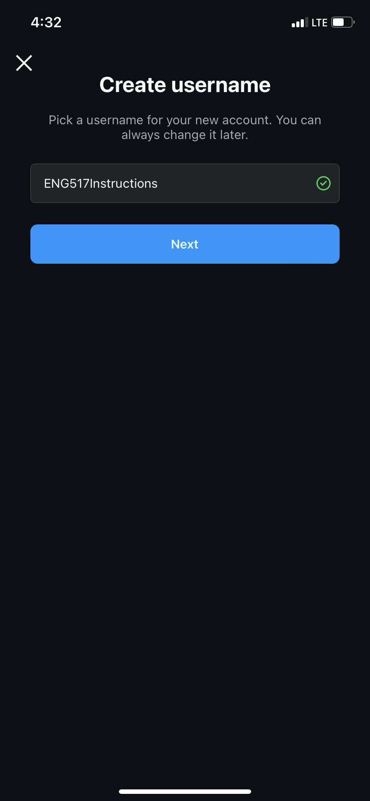
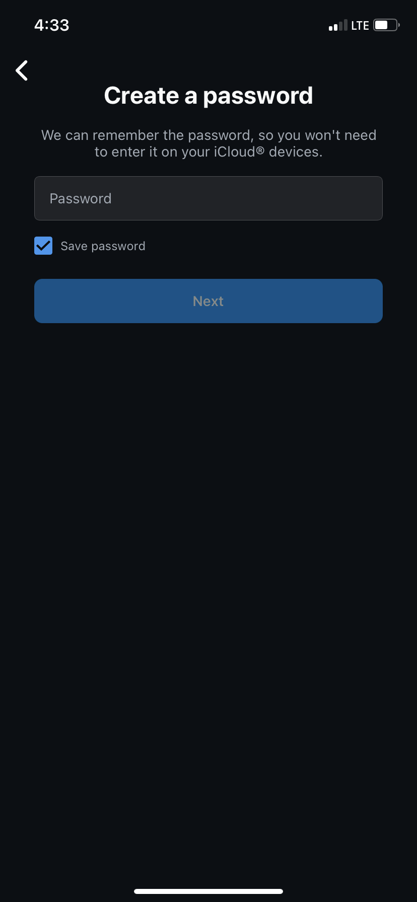
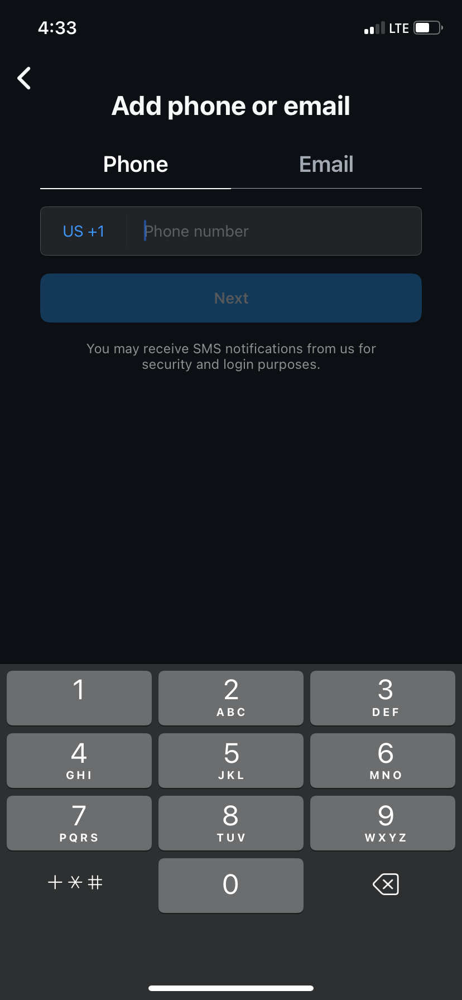
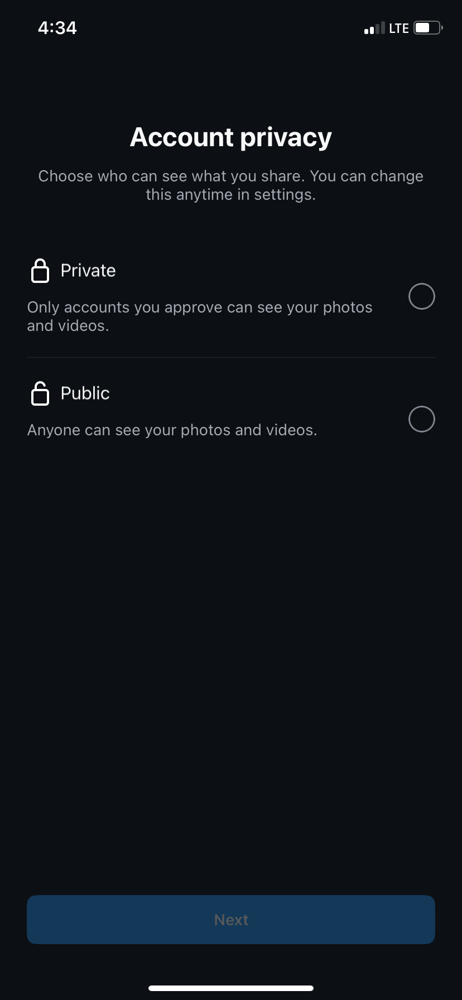
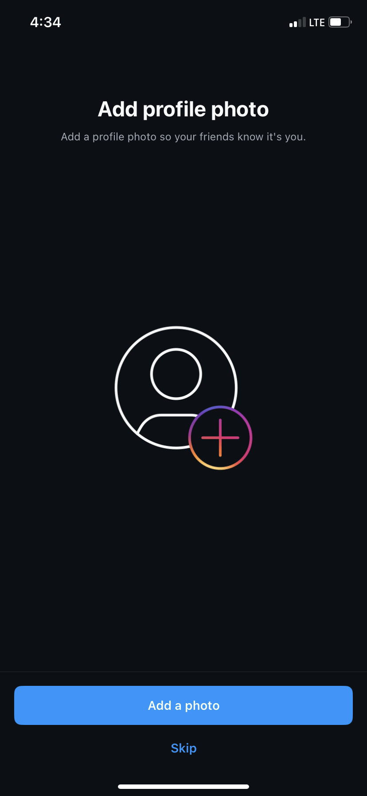

# How to create an Instagram account

This tutorial will instruct you how create an Instagam account. Even if you have no experience using social media, this article will tell you everything you need to get started with your first account.

Note: This tutorial is for mobile app users only

## What to do before reading this page
- Make sure you have available storage on your smart phone
- Download Instagram from the App store

## Setting up your account

### Getting Started
1. Open the Instagram App
2. On the login screen, select “create new account”
3. Create Username: Choose a unique username.
   
   Note: If your first choice is already in use, consider adding additional numbers onto the end of it
5. Choose a strong password with at least 8 characters, a lower and uppercase letter, a number, and one of the following symbols &*()_%$#@!
   
7. Enter your email address and phone number
   
8. Choose to either sync your contacts or skip this step
   
   Note: Syncing your contacts will make it easier to find people from your contacts who are on instagram, but if you are concerned about privacy, you may choose to manually follow other accounts.
9. Account privacy: Choose to make your account either public or private. If you make your account public, anybody can view your content even if they don't follow you. If your account is private, only your approved followers can view your page.
    
11. Add profile picture
    - Choose to import from Facebook, take photo, or choose from library
    - Select a profile picture you represent you
    - You can choose to share your profile picture as a post or skip this step
   
12.  Following other accounts
    - Instagram will now offer suggestions of accounts to follow. You can choose a few to follow or skip this step
13. At this point, instagram should redirect you to the home page. If you chose to publish your profile picture, you should see it on your feed.
