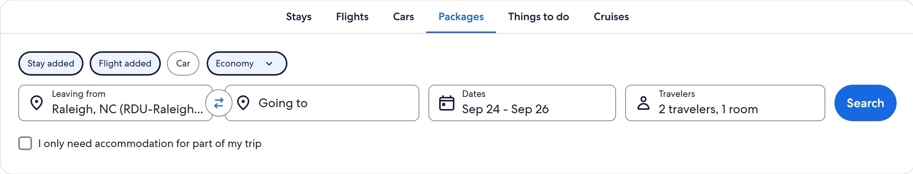
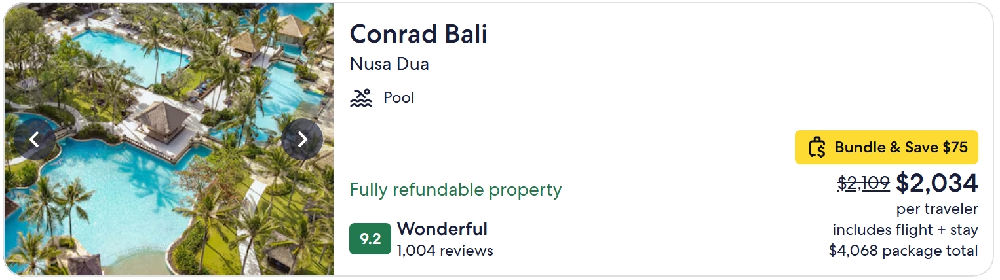
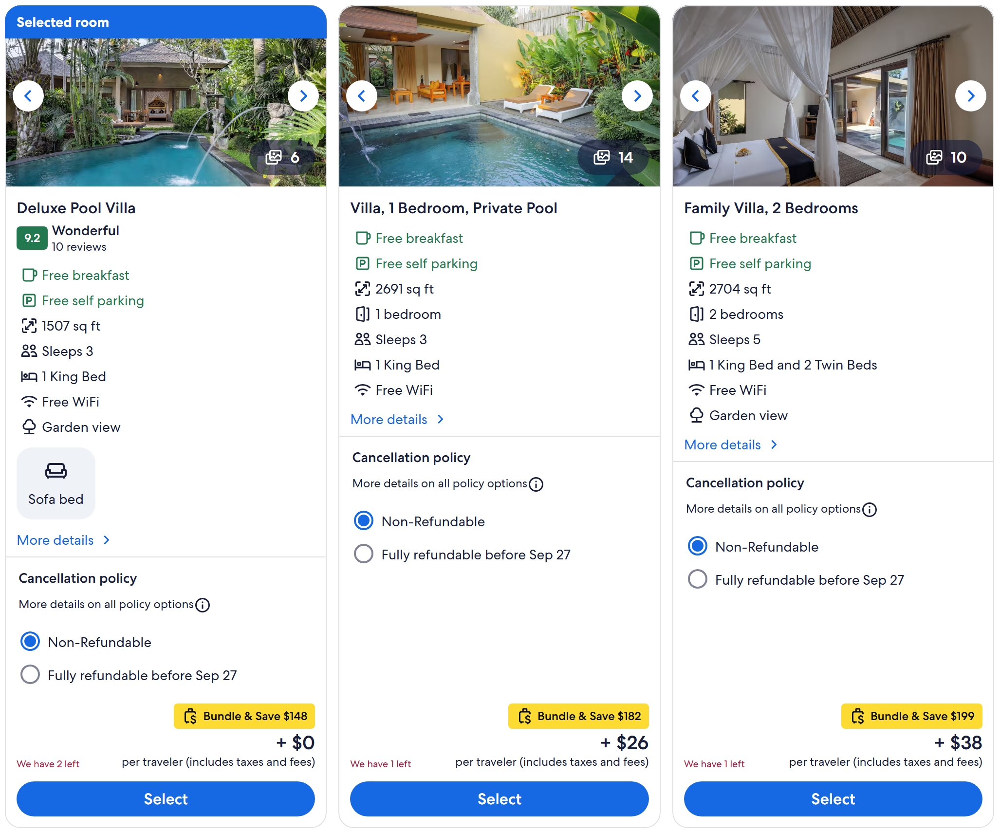
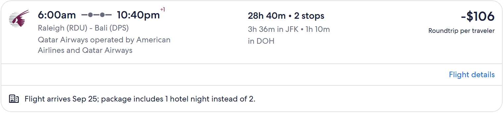
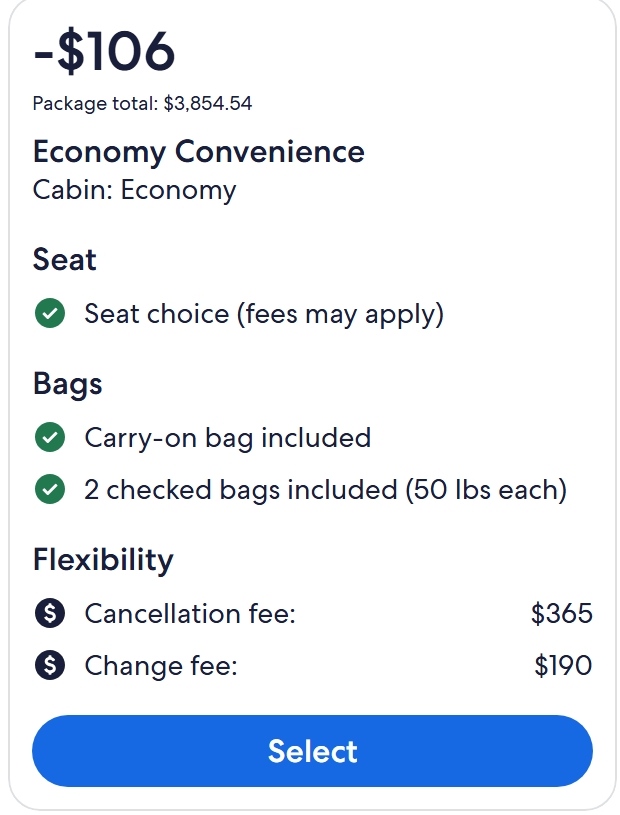
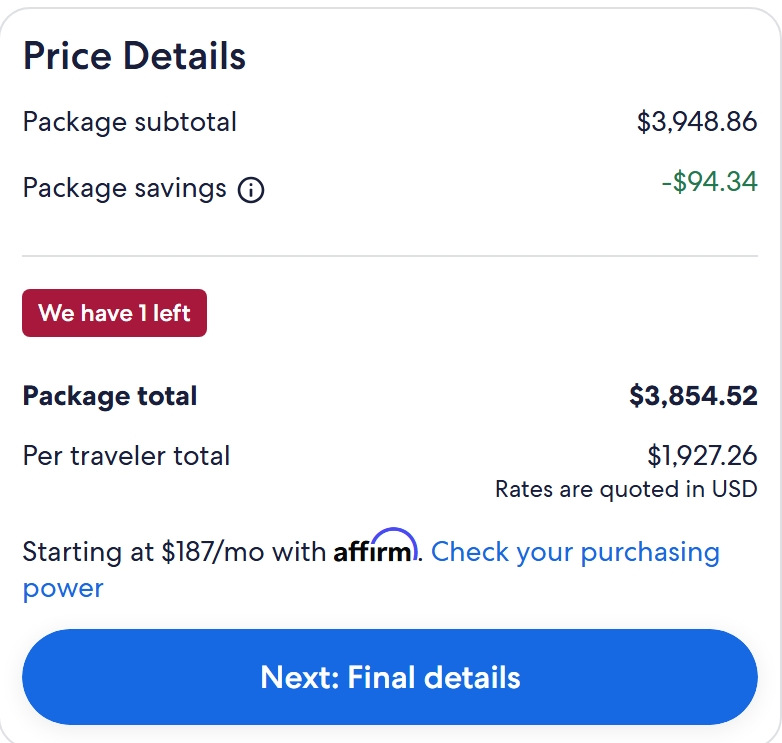
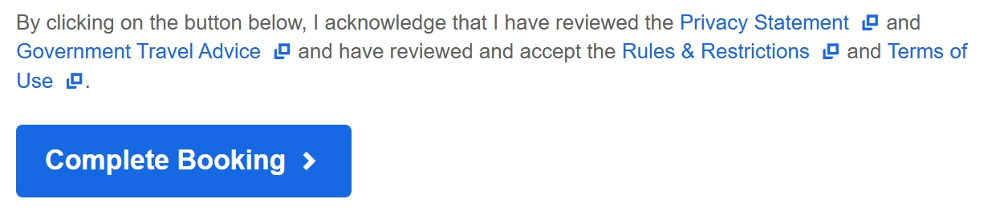

# Booking a Package on Expedia
Selecting a package on Expedia can be a useful way to secure all trip flights and accommodations at once. Expedia offers thousands of affordable, customizable packages to choose from worldwide.

This guide will demonstrate the process for using a package booking to secure:

* Accommodations
* Flights

>On Expedia, you also have the option to book car rentals, cruises, and excursions. This is a great option for those that prefer the ease of having all their travel bookings in one place.

## Prerequisite
You will need to have a location and budget in mind to make your booking choices.

## 1. Finding a Package

1) On Expedia's main page, click on 'packages'.

    

    *Figure 1.1: At the top of Expedia's main page, you will find several search selections to fit your travel needs.*

2) Enter your travel details, then click 'search'.

## 2. Selecting an Accommodation

A list of accommodations will appear, ranging in price and ratings. The total costs per traveler (including flights and accomodations) is included in the price estimate.

1) Select an accomodation.

    

    *Figure 2.1: Expedia offers many accommodation choices. Each listing displays highlights of the stay.*

Once you select an accommodation, a detailed page of information about the accommodation's features will appear. 

2) Click on 'select a room' or scroll down the page to choose from the room options.

    

    *Figure 2.2: The 'select a room' button is located to the bottom right of the accommodation images.*

>You can customize your stay, adding breakfast options and refund options if offered.

## 3. Selecting Flights

Once you have selected your accommodations, you will be directed to a list of flight options.

1) Select a flight from the list.

    

    *Figure 3.1: With a variety of flight choices, you can choose your preference based on departure time, flight duration, and price.*

A screen will appear, offering choices between flight classes.

2. Click 'select' on your flight class preference.

    

    *Figure 3.2: The benefits of each flight class are detailed on this screen to inform your choice.*

Conditional Step:

- If you chose a roundtrip flight, repeat the previous step, selecting the flights for your return trip.

## Next Steps

Now that you have selected your accommodations and flights, you can review and book your package.

1) Review your package.

2) Select the 'next: final details' button.

    

    *Figure 4.1: The 'Next: Final Details' button can be found after the price details section.*

3) Fill out the requested personal and financial information details.

4) Choose whether or not to protect your trip.

> Note: If you choose not to protect your trip, you will **not** recieve a refund if you cancel or change your trip.

5) Select 'complete booking' at the end of the form.

    

    *Figure 4.2: You can find links to the privacy statement, government travel advice, rules & regulations, and terms of use above the 'complete booking' button. For better inform your purchase, read these before confirming your booking.*

Once you have completed these steps, a booking confirmation email will be sent to your inbox. Enjoy your travels!