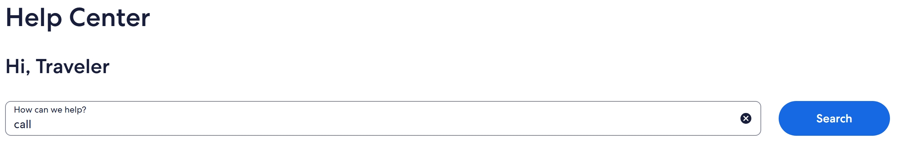
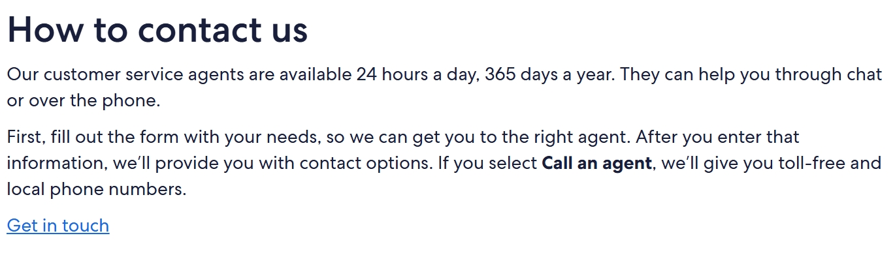
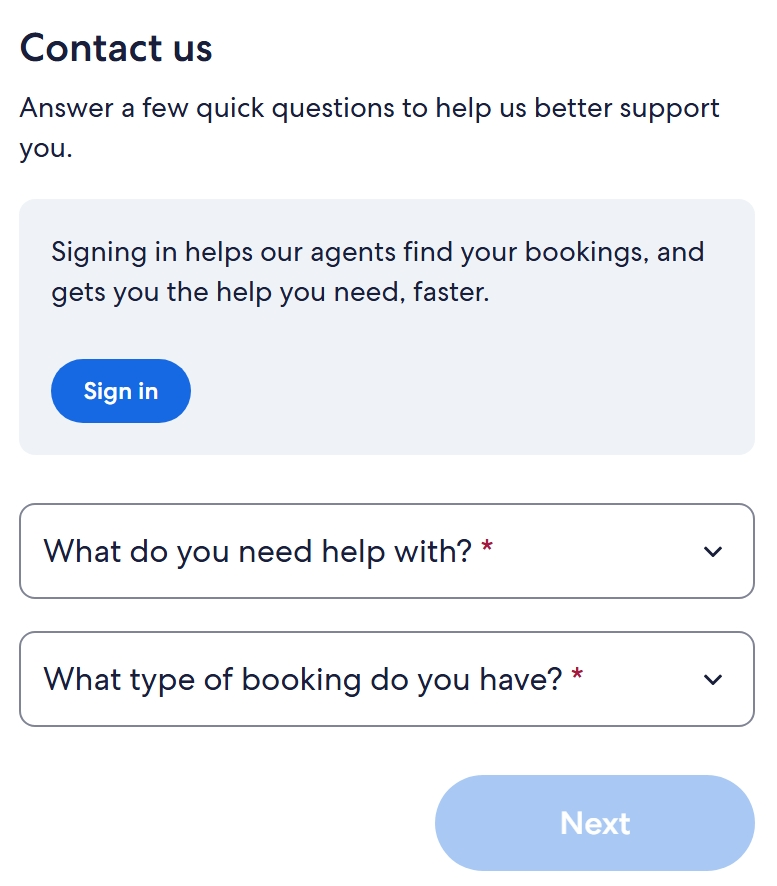
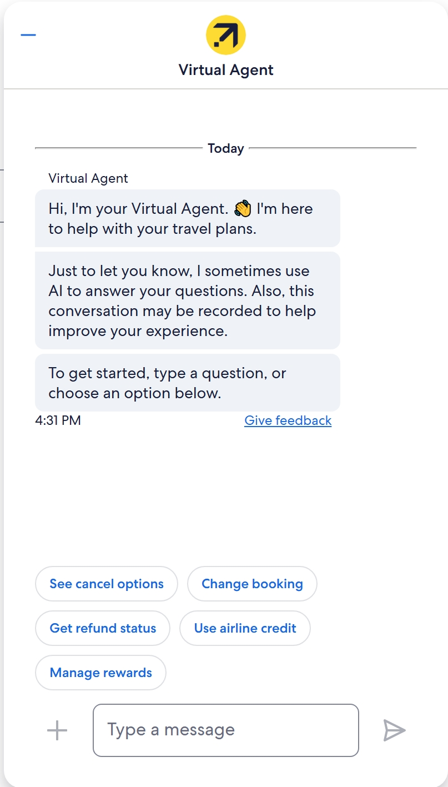

# Finding Support in Expedia

The process for seeking help on a busy travel booking website can appear as daunting and overwhelming. This guide will provide a step-by-step walkthrough on two different ways to report an inquiry.

## About Expedia's Support Services

Expedia offers multiple guides to assist travelers through their booking experience, including help articles on:

* Flights
* Packages
* Things to Do
* Refunds and Charges
* Travel Alerts
* Security
* Privacy

In this guide, we will explore two tools for contacting customer support.

* Submitting a Contact Us Form
* Messaging the Virtual Agent

<!-- ## Prerequisites
You will need access to a computer and a stable WiFi network.
-->
## 1. Submitting a Contact Us Form

1) Select the Support button
    - This can be found on the upper-right side of the page

> *Figure 1.1: At the top of the main webpage, select the 'Support' button.*

2) Type your inquiry in the search bar
    - To easily search for the contact page, you can type "call", "call line" or other variations

> *Figure 1.2: In the search bar, you can ask your inquiry to find a variety of resources.*

3) Click on the 'search' button

Once you have clicked on 'search', a list of resources will appear.

4) Select the 'how to contact us' link

>*Figure 1.3: From the search list, select 'how to contact us'.*

A message will appear with directions on how to contact Expedia.

>*Figure 1.4: The message provides directions to connecting with customer support.*

5) Click 'get in touch'

The following form will appear. From here, you can submit details of your inquiry and the Expedia team will reach out to you shortly.

>*Figure 1.5: Filling out this form will put your inquiry in the care of a customer service representative, who will reach out to you shortly with guided assistance.*

## 2. Messaging the Virtual Agent

Alternatively, you can use the Virtual Agent feature to message with an agent instantly.

1) Select the 'help' button
    - this button can be found at the bottom-right corner of your screen

>*Figure 2.1: Selecting the help button will open the virtual agent's messaging screen.*

2) Type your inquiries to the virtual agent

>*Figure 2.2: A list of prompts will guide your experience, leading to personalized assistance.*

Answering the prompted questions will guide the virtual assistant to put you in contact with the right customer representative.

