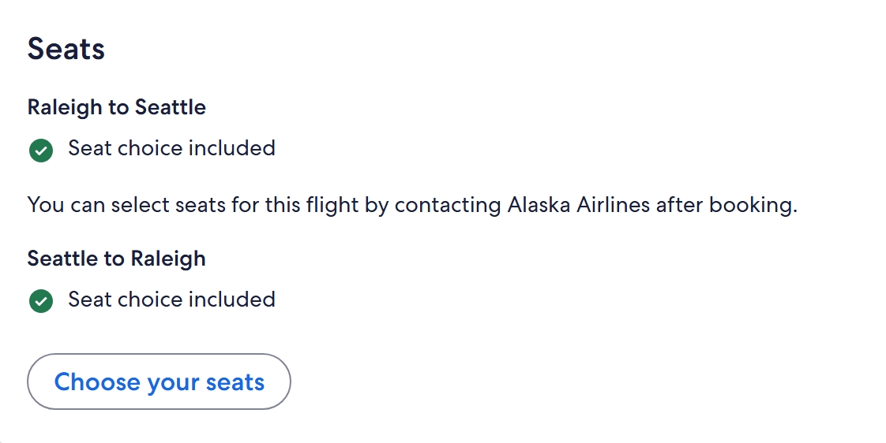
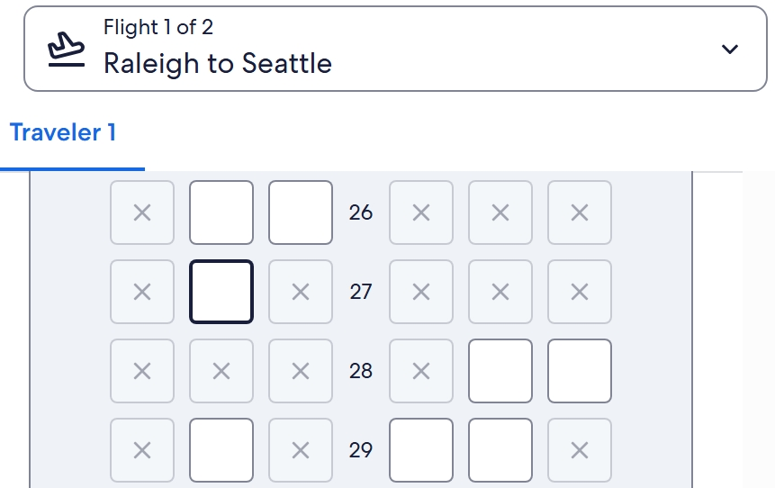
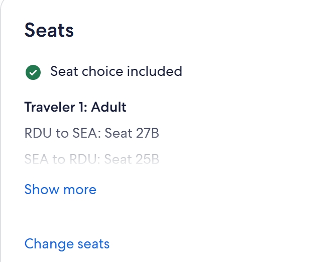

# Selecting Flight Seats on Expedia

A benefit to most Expedia flights is the option to select seats. The process to select seats through Expedia's site involves choosing and confirming seats. The visual process, which immitates a birds-eye view of the plane's interior, helps to make choosing the best seat a seamless experience.

This guide will teach you how to:

* Choose Seats
* Change Seats

## Prerequistes
- You must select a flight option that allows for seat selection.
    - The ability to select seats is dependent on the flight class (eg., economy plus, business).

- Depending on the airline, you may need to book the flight first before you are eligible to select seats.

> If the airline requires you to first book the flight, you will use the personalized flight number attached to your email receipt to find your information on the airline's website. From there, you will be able to personalize your experience, which will include the option to select your seat preferences.

## Getting Started 

As you are finalizing your flight, head to the **flight details** section in your booking process.

## Choosing Seats

Once you have arrived to the flight details page in your booking process, you will now have the option to select your seats.

To select your seats, 

1) Scroll to the 'seats' section and click on 'choose your seats'.

    

    *Figure 1.1: The seats section will display your flights and the accompanying seat choice inclusion.*

>   Note: If there is a red **X** mark, then you will need to return to the flight selection section and change the flight class for each flight that you wish to have seat choice.

The next screen will provide a virtual map of the airplane's seating chart.

2) Click on the seat of your choice.

    

    *Figure 1.2: Expedia provides a virtual map of the plane, making it easy to find your preferred seat choice.*

Each square box indicates a seat. The light gray boxes with an X are reserved seats. The number indicates the row on the plane. Select your seat from the array of black-outlined boxes.

>Note: Premium seats may be offered at an additional charge.

3) Click the 'select seat' button on the bottom-right side of the screen.

Optional Step:
- Repeat the process for any additional flights.

## Changing Seats

To change your seat selections:

1) Select 'change seats' in the seats section on the flight details page.

    

    *Figure 2.1: At the bottom of the seats section, select 'change seats' to update your seat preference.*

2) Follow through the same process of choosing and confirming your new seats.