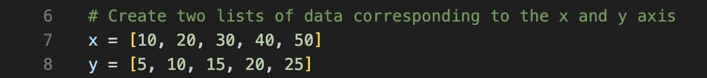
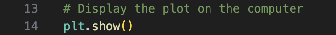
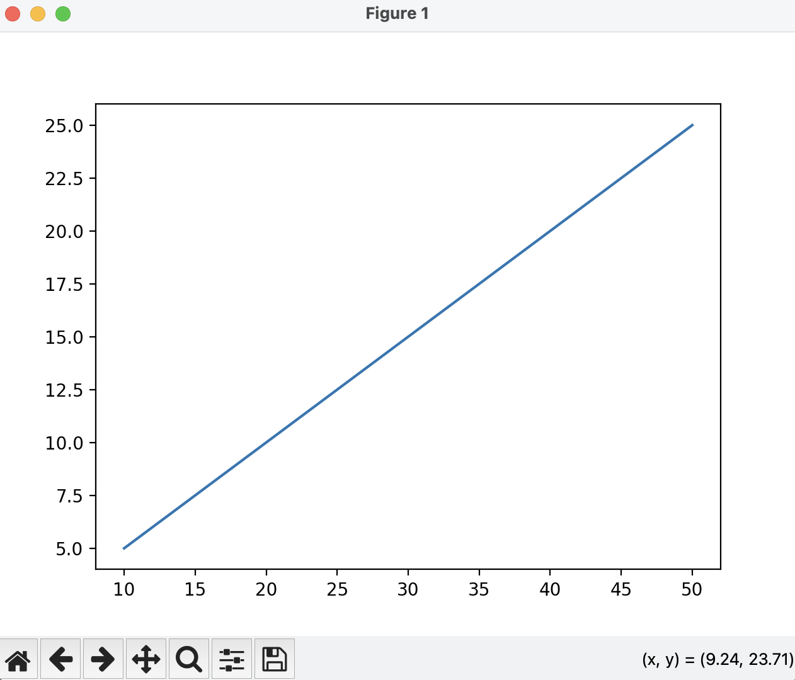

# Create a Line Chart
In this section you will learn how to create a line chart, using Python and Matplotlib.

1. **Import Matplotlib into Python**
To get started, import the matplotlib.pyplot library. 

2. **Identify your data**
In this example, I create two lists of data representing x and y values. These are the values that plot on your line chart.

3. **Create the line plot**
Using the "plot()" function creates a line chart.

4. **Display the Plot**
"(plt.show)" allows the plot to be displayed on your computer

5. **Final Plot**
Run the full block of code and a figure will be displayed on your computer like so:

