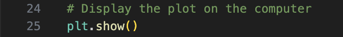
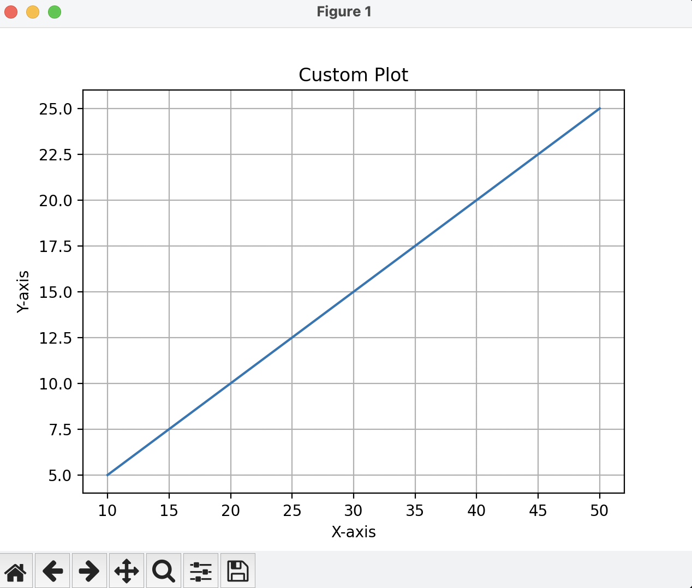

# Customize the Line Chart

In this procedure, I will show you how to customize the line chart that you previously made by adding titles, axis labels, etc.

## Step 1: Import Matplotlib into Python

## Step 2: Define your data
Define your data using x and y values.

## Step 3: Create the line plot
Create the line plot using "plt.plot()"

## Step 4: Add a title to your plot
Add a title to your plot using "plt.title()"

## Step 5: Add axis labels
Add axis labels using "plt.xlabel()" and "plt.ylabel()" respectively.

## Step 6: Add lines on the grid
Add a line grid to the plot using "plt.grid()"

## Step 7: Display your plot
Display your plot using "plt.show()"

## Step 8: Final figure
You have now made a customized line chart!

