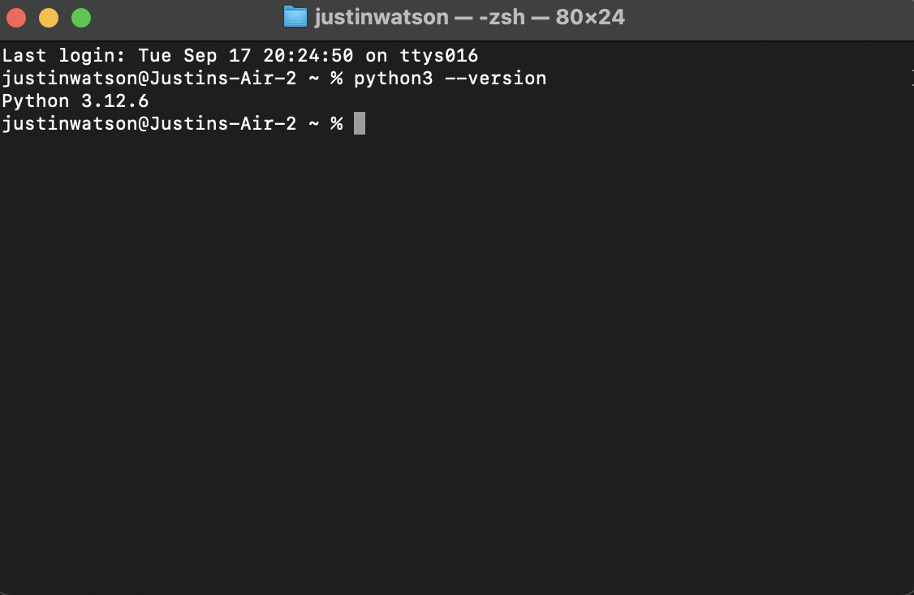
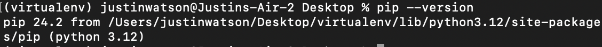
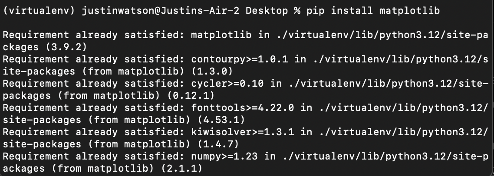
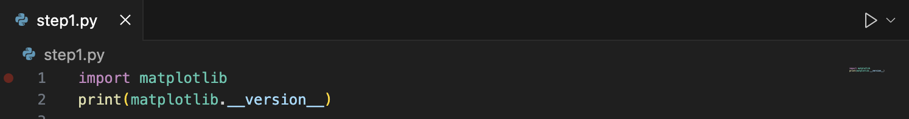
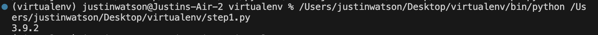

# How to Install Matplotlib

In this section, you will learn how to install the "matplotlib" library in Python, which is necessary for creating data visualizations. 

## Prerequisites

Before installing "matplotlib", ensure you have Python and "pip" installed on your computer. You can check if Python is installed by running the following command in your terminal:

"python3 --version"

You can check if pip is installed by running the following command in your terminal:
"pip --version"

## Step 1: Install Matplotlib

You can install Matplotlib by opeing your computer's terminal and running the following command:
"pip install matplotlib
 

## Step 2: Verifying Matplotlib is installed

To verify Matplotlib is installed, navigate to your IDE and type the following.
"import matplotlib
print(matplotlib.__version__)"

After running the two lines of code in your IDE, you should see the matplotlib version in your terminal:
"

