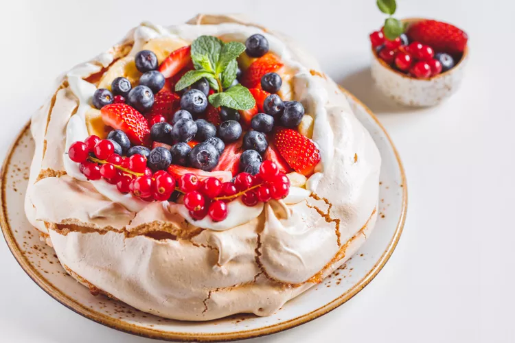

# How to make a Pavlova

A pavlova is a meringue presented as a cake, and comprised of just five common ingredients. It looks a lot fancier than it is. Feel free to get creative!

A meringue may seem intimidating but it is just a combination of egg whites and sugar that has a lot of air whipped into it, making it expand in size.

## Ingredients
- 1 cup of white sugar
- 4 egg whites
- 1 teaspoon of cornstarch [^1]
- ½ teaspoon of cream of tartar [^2]
- 1 teaspoon of vanilla extract

## Instructions

1. Preheat an oven to 350 degrees Fahrenheit.
2. Line a baking sheet with parchment paper, set aside.
3. In a bowl separate the whites and yolks of 4 eggs, set the yolks aside for a different recipe. 
4. Whip the egg whites with a handheld mixture or in a standing mixer. After about five minutes the egg whites should reach a soft peak stage. [^3]

5. Slowly pour in the sugar as the whipping continues. Once the sugar is added, turn the mixer speed up to high and keep whipping until stiff peaks form, this can take between 2-5 minutes.

:strip_icc()/recipes-how-to-bake-how-to-beat-egg-whites-to-stiff-peaks-10-b8b325057fef4f85aa98e3c1b33c249b.jpg)

6. Add in the vanilla extract. Whip for one more minute. 
7. Finally, add in the cream of tartar and cornstarch. [^4]
8. Spread the Pavlova out onto the pan, you can get creative with the shaping and sizing. But the one consistent detail is a dip in the center and relatively tall edges.
9. Place pavlova in the oven. As soon as you close the oven door, reduce heat to 200°F (93°C). 
10. The pavlova will stay in the oven as it cools down to 200°F (93°C). Bake until the pavlova is firm and dry, about 90 minutes total. Turn the oven off and let the pavlova cool inside the oven. 

Keep an eye on it from time to time, and rotate the pan if there is any excessive cracking or toasted spots. This is for aesthetic purposes only, a little crisp or cracking won’t affect the taste.

A pavlova is traditionally topped with fresh fruit, but you can top it with whatever you like, including but not limited to:
- Fruit Jam
- Whipped Cream
- Lemon Curd
- Pudding
- Ice cream
- Caramel
- Honey

[^1]: Cornstarch helps add structure to the mixture but stabilizing the air bubbles being whipped into it, it also keeps the meringue from weeping or collapsing by soaking up any excess liquid.

[^2]: Cream of Tartar or tartaric acid is a white powder that can be found in the spices and baking section of most grocery stores. It functions as a stabilizer in the process of adding air to the egg white and sugar mixture - making it easier to achieve soft and eventually stiff peaks. You can make a meringue without it, but it will take longer to achieve and maintain the appropriate texture.

[^3]: Whipping by hand would be a long and brutal process.

[^4]: I recommend sifting through these ingredients before gently mixing them in. If the dry ingredients aren’t sifted, you may bite into tiny bitter crunchy bits of them. 
