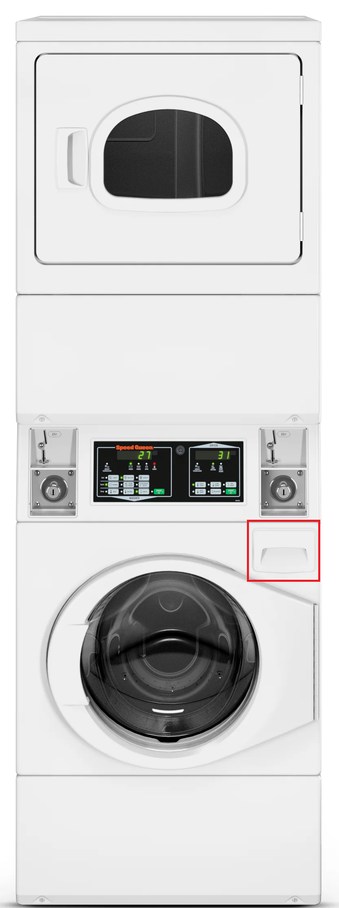
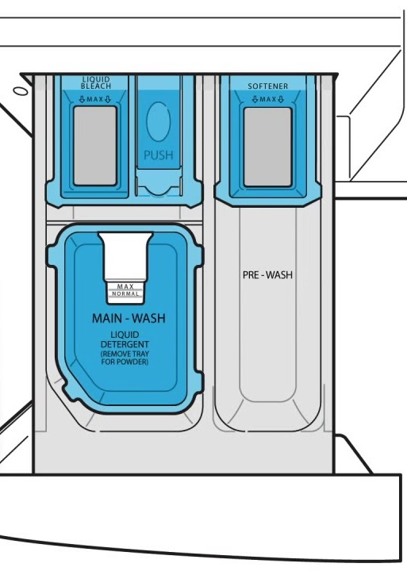
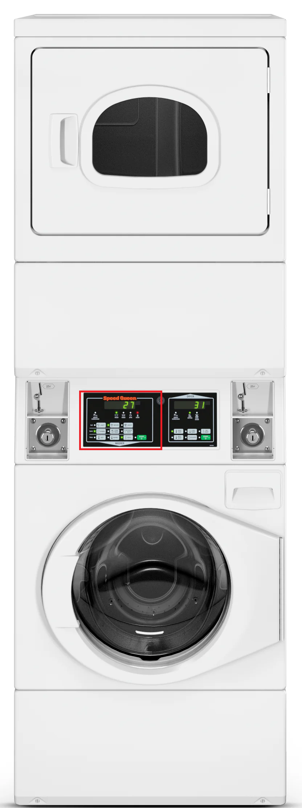

# Washing Laundry with NC State Laundry Machines

University Housing provides all residents living in Wolf Village with free and private laundry machines in their apartment.

Washing your laundry is simple and will only take you a few minutes to learn (the machines will take care of the rest!)

**Note**: Residents must use their own detergents, dryer sheets, and other cleaning supplies.

## Washing your Clothes

1. Load dirty clothes in the washing machine. The washing machine is the bottom machine.
   
2. Add high-efficiency detergent to the washer.
   
    * If using detergent pods, place the pod directly in the washing machine drum.
  
    * If using liquid detergent, pour detergent into the detergent compartment in the drawer. 
  
3. Optional: add bleach and fabric softener into the labeled compartments.
   

   * **Note**: scent beads go directly into the washer drum.
   
4. Close door.
   
5. Press start or the left control panel.
   
   
    * **Note**: Settings will be in their default states, which is fine for most clothes
  
Your laundry is now in the wash cycle. The control panel will display the remaining time in the cycle.

## Drying your Clothes

1. Remove the wet clothes from the washer and move them into the dryer.
   
2. **Alert**: Ensure the lint trap is empty.
   
   * The lint trap is located below the dryer door openning.
   
3. **Optional**: Add a dryer sheet or dryer balls.

    * This will help reduce dry time, and static clothes.
    * **Note**: never put scent beads in the dryer.

4. Close dryer door.

5. Press "WARM TEMP".

6. Press start on the dryer's control panel.

Your clothes are now drying! The time remaining on the dry cycle will be displayed on the control panel.
  
**Alert**: Clean the lint trap when the machine is finished to avoid the risk of fire.

Congratualations on washing your laundry, now enjoy your clean and fresh clothes!