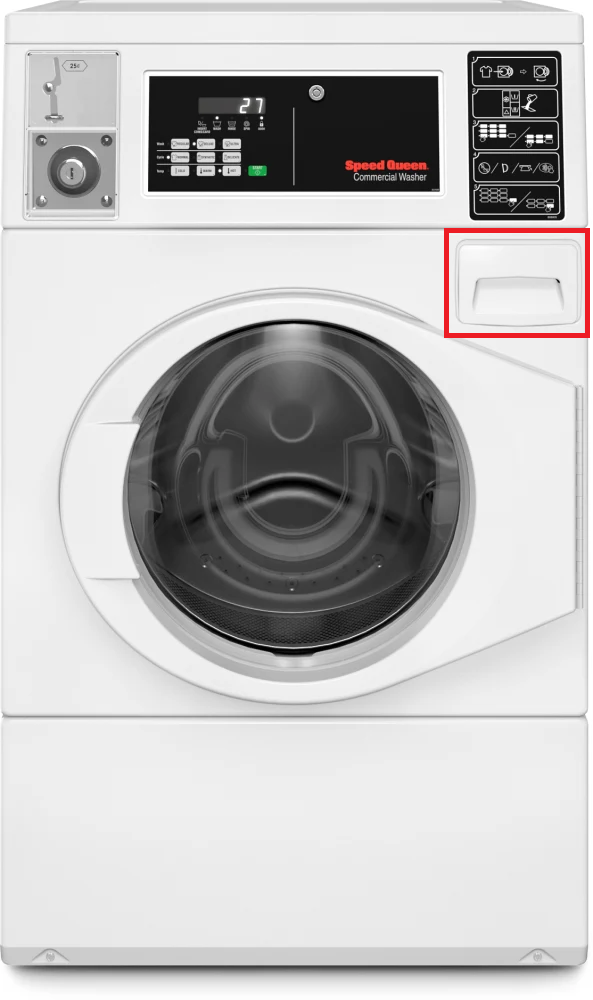
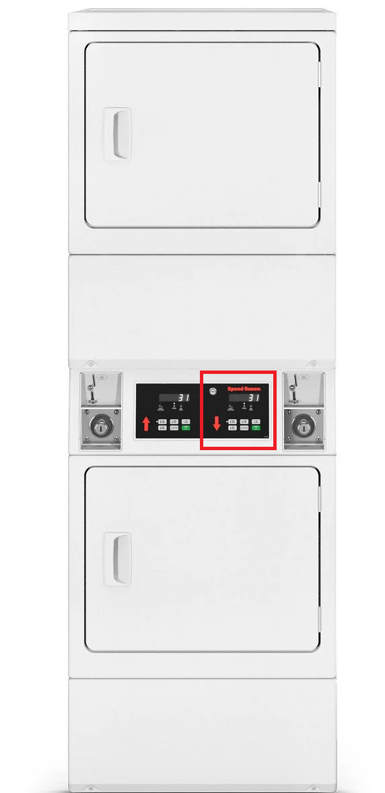

# Washing Laundry with NC State Laundry Machines

staging

## Washing your Clothes

1. Load your dirty clothes into the washing machine
   * **Optional**: separate clothes into whites and colors
  
2. Add detergent to the washer
   * If using **detergent pods**, place pod directly in washing machine drum
   * If using **liquid detergent**, pour detergent into the detergent compartment in the drawer in the top right 
  

3. **Optional**: add bleach and fabric softener to drawer
   
4. Close door firmly
   
5. Configure the settings with the control panel
   * **Note**: settings will revert to default after each cycle
  
6. Press start
  
Your laundry is now going through the wash cycle. The control panel will display how much time is remaining in the cycle. 

**Tip**: Set a timer on your phone to keep track of your laundry and remove your laundry in a timely manner

## Drying your Clothes

1. Load wet clothes into the dryer drum
   * **Alert**: Check the lint trap to ensure it is clean
   * **Optional**: Add a dryer sheet or dryer balls to reduce dry time

2. Close the dryer door
   
3. Select desired mode with the correct control panel
   * ex. If you are using the bottom dryer, use the right control panel
   * 

4. Press start

Your clothes are now drying. The time remaining on the dry cycle will display on the control panel.

**Tip**: Set a time on your phone to remember to remove your clothes from the machine.

**Alert**: Clean the lint trap when your clothes are finished drying to avoid risk of fire.
